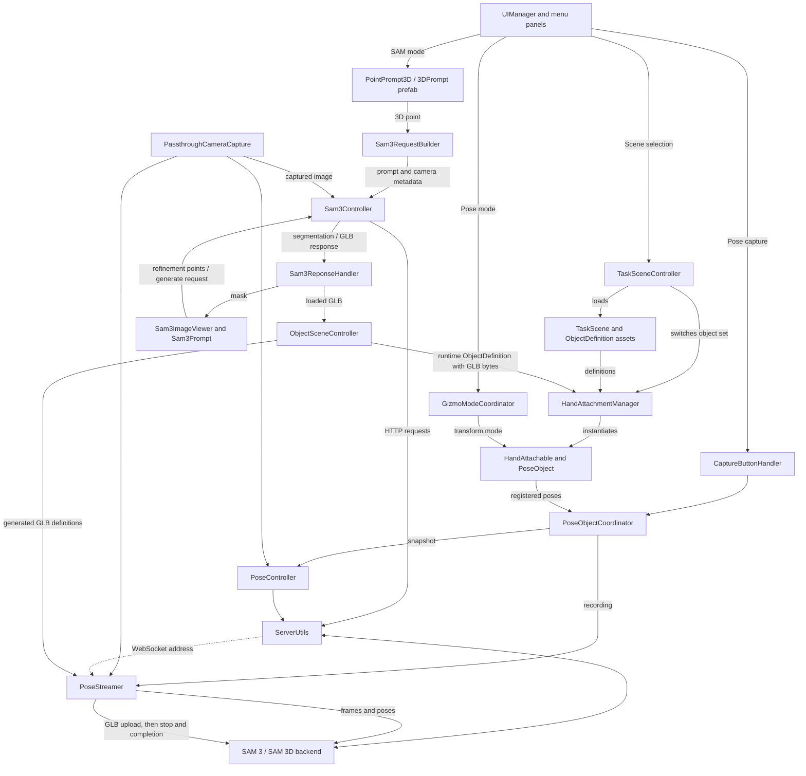

# MiDAS

MiDAS is a mixed reality pose annotation tool. An annotator aligns virtual 3D objects with real objects seen through the headset, then captures or streams the resulting poses. This README covers [`Assets/Scenes/MainScene.unity`](Assets/Scenes/MainScene.unity).

## Getting started

### Install and build

1. Open the project in **Unity 6000.3.2f1** and allow Unity to import its packages. The project uses the Meta XR SDK and passthrough camera features, so use a compatible, configured Meta Quest device.
2. Open `Assets/Scenes/MainScene.unity`. Select **Android** as the build target and include `MainScene.unity` in the build scene list. The checked-in build settings still enable an older scene, so replace that entry when building this workflow.
3. Build and run the app on the headset. The segmentation, 3D generation, and pose capture workflows also require their corresponding backend services to be running and reachable from the headset.

The Unity project contains the headset client; backend implementation and launch instructions are not included here.

### MiDAS workflow

1. In **Settings**, set the backend IP address, capture FPS, and BOP export option.
2. In **Scene**, choose the set of objects to annotate.
3. In **SAM**, reconstruct an additional 3D object if needed.
4. In **Pose**, align the virtual objects with the real ones, then take a snapshot or record a capture.

## Menus

### Scene

A *scene* in this menu is a **task object set**, not a separate Unity scene. `TaskSceneController` selects a `TaskScene`, whose `ObjectDefinition` entries identify the object models. `HandAttachmentManager` instantiates the selected objects and arranges them around the left hand for selection. Starting a transform detaches an object from the hand so it can be aligned with the real object. The Scene menu also provides a reset action that reattaches the current objects.

### Pose

Select an object and align it using one of four transform modes: **Free**, **Translate**, **Rotate**, or **Scale**. `GizmoModeCoordinator` applies the selected mode to the object gizmos. In Pose mode, the capture controls can send a single snapshot or start and stop a recording. A snapshot sends the camera image and projected object bounding boxes to the backend; recording streams frames and pose data. When recording stops, `PoseStreamer` uploads the original GLB bytes for generated objects in the current session, sends the stop message, and waits for a backend completion response before closing the connection. An upload error or completion timeout is logged. Object visibility can also be toggled during capture.

The object setup starts at `PoseObjects` in `MainScene.unity`. Its `HandAttachmentManager` creates one [`3DObject` container](Assets/Prefabs/3DObject.prefab) for each object definition. The diagram shows the creation structure; the containers are reparented during interaction:

```text
PoseObjects (HandAttachmentManager)
└── 3DObject (created from 3DObject.prefab for each object)
    ├── HandAttachable
    ├── GizmoTransformManager → target: ObjectVisuals
    ├── ObjectVisuals (PoseObject component)
    │   ├── 3DBox (bounding box geometry)
    │   └── instantiated object mesh
    │       ├── predefined object: prefab from its TaskScene definition
    │       └── SAM-generated object: mesh from the returned SAM 3D GLB
    ├── ObjectHandles (transform controls)
    └── FloatingObjectLabel
```

`ObjectVisuals` is the GameObject transformed by `GizmoTransformManager`; the `3DBox` is a separate bounding box, not geometry from the GLB. For a SAM-generated object, `ObjectSceneController` stores the imported GLB mesh in a runtime `ObjectDefinition`, and `PoseObject` instantiates it beneath `ObjectVisuals`. `HandAttachable` parents the container to the hand anchor until a transform starts, then detaches it so the object can be aligned in the world.

### SAM

SAM adds a generated 3D object to the active session:

1. Use the [`3DPrompt` prefab](Assets/Prefabs/SAM3/3DPrompt.prefab) to place a point on the real object in 3D.
2. Request segmentation. The headset captures an image and sends the point and camera metadata to SAM 3 on the backend.
3. Inspect the returned mask in the image overlay. Add positive or negative points and refine the segmentation until the mask is satisfactory.
4. Request 3D generation. The image and mask are sent to SAM 3D, which returns a GLB model.
5. The client loads the GLB, stores its original bytes in a runtime `ObjectDefinition`, and adds an interactable copy through `HandAttachmentManager`.

Generated objects are registered for the current runtime session. Their GLB bytes are sent to the backend when a recording ends, but the current `SaveObject` method does not write the generated model or definition to local disk, and the new definition is not added to the `TaskScene` asset.

### Settings

Configure the backend IP address, recording frame rate (FPS), and whether recorded pose data uses the BOP format. The IP address is shared by the capture, segmentation, and 3D generation requests; `ServerUtils` holds their service ports (defaults in the script: **8000** for the main service and **8001** for SAM 3D).

## Script interaction

The arrows show the main runtime calls and data flow in `MainScene.unity`:



`ServerUtils` sends snapshot and segmentation HTTP requests and supplies the address used by the recording WebSocket. `PoseStreamer` uses that WebSocket to upload generated GLBs at the end of a recording. The diagram omits view components and low level interaction helpers to keep the primary paths readable.
